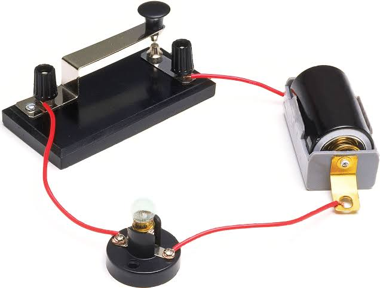
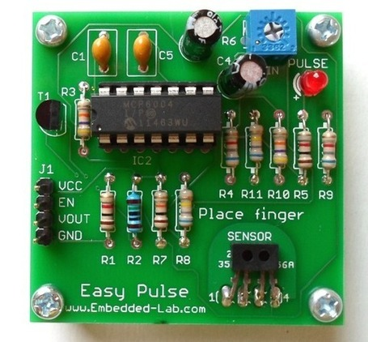

# Introduction aux circuits électriques

Un circuit électrique est un ensemble de fils et de composants interconnectées dans lequel circule une charge électrique afin d'y effectuer un travail.

Un circuit est composé des éléments suivants : 
- Une source de courant
- De composants effectuant un *travail*
- De conducteurs reliant les différents composants entres eux et la source de courant.

La source de courant possède deux bornes : une borne positive (+) et une autre négative (-). On va, conventionnellement, dire que le courant électrique circule de la borne positive vers la borne négative.

Dans sa forme la plus simple, des fils conducteurs vont effectuer les connexions entre les composantes.

En électronique, nous allons généralement voir les circuits sous forme de PCB (circuit imprimé) - plaquettes sur lesquels des traces cuivres font les liens entre différents composants.

## Circuits ouvert et circuit fermé

Un circuit qui présente un chemin complet du pôle positif au pôle négatif est dit `fermé` :

Dans le cas contraire, on va parler d'un circuit ouvert. Des composants tel un *bouton poussoir*, un *interrupteur*, ou bien même un *transistor* peuvent faire passer un circuit d'ouvert à fermer et vis versa. 

Lorsque le circuit est ouvert, le courant **n'y circule pas**. Le courant circule uniquement lorsque le circuit est **fermé**.

**Circuit avec bouton poussoir :**

Le circuit est dit `ouvert` jusqu'à ce que quelqu'un appuie sur le bouton. Tant que le bouton est appuyé, le circuit est `fermé`

**Circuit avec interrupteur :**

L'interrupteur a 2 positions possible : dans l'une le circuit est dit `ouvert`, dans l'autre il est `fermé`.

## Courts circuits

Lorsqu'un circuit comprend plusieurs branches, le courant va emprunter les différentes branches en proportion à la facilité qu'il a à les traverser.

Dans ce circuit, le courant va passer par les chemins **A** et **B**.

Comme **B** est 2x plus ardu comme chemin que **A**, 2x plus de courant va passer par **A** que par **B**.

Lorsqu'un chemin ne présente _aucune résistance_, l'entièreté du courant va passer par ce chemin.

Dans ce circuit, aucun courant ne va passer par le chemin **B**. Nous sommes en présence d'un **court circuit**.

## Paramètres électriques

### Tension

La tension représente l'énergie qui pousse notre courant électrique. Concrètement, la tension est la différence de potentiel électrique entre 2 points (nos pôles positifs et négatifs). 

**Unité de mesure** : le **V**olt.

### Résistance

La résistance représente la difficulté avec laquelle une charge électrique va passer au travers un circuit. L'inverse de la résistance (1/R) est la conductivité.

**Unité de mesure** : le **O**hm.

### Courant

Le courant représente le flot concret d'énergie dans un circuit.    

Un courant d'un ampère est énorme lorsqu'on parle d'électronique. On va habituellement travailler en milliampères (mA). 

Aussi appelé **intensité**. Le courant est donc souvent représenté par un `I` dans les formules.

**Unité de mesure** : l'**A**mpère.

#### Charge électrique

Lorsque l'on veut parler de la charge électrique d'une pile ou d'une batterie, nous allons utiliser les (milli)ampère-heure(mAh).  Cette mesure représente un courant soutenu pendant 1h.

Une pile ayant une charge électrique de 15mAh va pouvoir soutenir un courant de 15mA pendant 1h, 30mA pendant 30 minutes, 60mA pendant 15 minutes, 5mA pendant 3 heures, etc...

### Puissance

La _puissance électrique_ est le taux, par unité de temps, auquel l'énergie _électrique_ est transférée par un circuit _électrique_.

**Unité de mesure** : le **W**att. 

*Phoque électrique du Manicouagan - source écoresponsable d'électricité au Québec. *

## Liens utiles

URL : [Circuits Circuits électriques : lois élémentaires pour la tension et le courant](https://www.youtube.com/watch?v=m4jzgqZu-4s) (10 min)

URL : [énergie et puissance des batteries](https://www.youtube.com/watch?v=u4FpbaMW5sk) (10 min)

URL : [Risques](https://www.youtube.com/watch?v=LHIfrX5dIwg) (5 min)