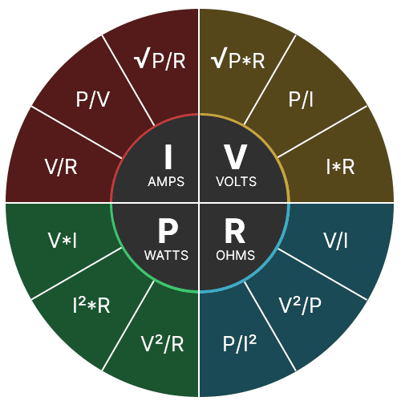

# Loi d'Ohm

Loi décrivant la relation entres les différents paramètres électriques.

```
Tension = Courant * Résistance
V = R * I

Puissance = Tension * Courant
P = V * I
```

Ces deux formules peuvent être transformés en différentes équations qui vont nous permettre d'isoler différents paramètres selon nos besoins. 



## Résistance en série et parallèle

### Série 

Lorsque deux (ou plus) résistances s'enchainent dans un circuit, nous disons qu'elles sont en *série*. La résistance totale d'un circuit en série correspond à la sommes de toutes les résistances.

Ainsi ``R_t = R_1 + R_2 + R_3 ...`


Dans ce circuit, la résistance totale est donc de `10kΩ + 220kΩ + 440kΩ = 670kΩ`

**Question :** Assumant une tension à la source 9V, quelle est le courant passant dans ce circuit?

![[Pasted image 20260817130128.png]]

**Question :** Quelle est la résistance totale de ce circuit?

**Question :** Assumant qu'un courant de 0.008mA traverse ce circuit, quelle est la tension à la source?

### Parallèle

Lorsqu'un circuit comporte plusieurs branches, on dit que ces branches sont en parallèle. On calcul les résistance en parallèle à l'aide de la formule suivante : 

`1/R_t = 1/R_1 + 1/R_2 + 1/R_3 ...`

Où : 
- R_t est la résistance totale
- R_1 est la résistance totale de la première branche
- R_2 est la résistance totale de la deuxième branche
- ...

Donc : 


Dans ce circuit, la résistance totale se calcule ainsi  :

```
1/R_t = 1/R_1 + 1/R_2
1/R_t = 1/100kΩ + 1/100kΩ
1/R_t = 2/100kΩ
1/R_t = 1/50kΩ
R_t = 50kΩ
```


**Question :** Quelle est la résistance totale dans le circuit ci-dessus?


**Question :** Quelle est la résistance totale dans le circuit ci-dessus?

### Série + parallèle

Les circuits vont souvent combiner des segments à la fois en série et en parallèle. Les mêmes règles s'appliquent.


**Question :** Quelle est la résistance totale dans le circuit ci-dessus?


**Question :** Quelle est la résistance totale dans le circuit ci-dessus?