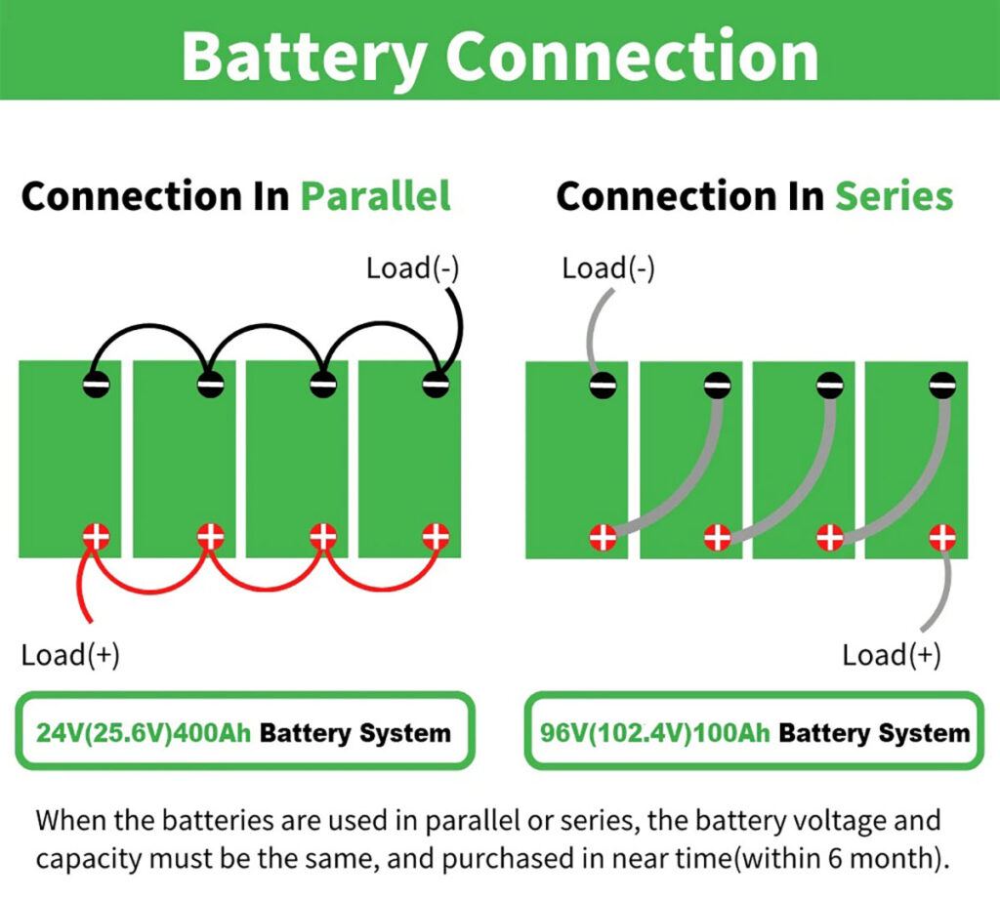

# Trousse de matériel

## Platine d'essai

## Piles et batteries

**Pile :** Cellule fournissant un certain voltage

**Batterie :** Ensemble de pile fournissant un voltage plus élevé.

Les batteries communes communes (AA, AAA, D) vont fournir une tension de 1.5V. 

Ces batteries peuvent être connectées en série afin d'augmenter la **tension** fournie. Dans cette situation, la **charge** ne change pas.

Elles peuvent être aussi branchée en parallèle. Dans cette situations, la **charge** va augmenter, mais la **tension** fournie va rester la même.

Le fil **rouge** va normalement représenter le pôle positif et le fil **noir** le ground/pôle négatif.

### Un mot à propos des batteries

Les batteries sont généralement étiquetées avec une spécification indiquant leur courant de décharge maximum ou leur capacité de décharge. Voici un exemple typique d'une spécification par le fabricant du taux C sur une batterie

Batterie Li-ion 18650 
- Capacité nominale : 2500 mAh (milliampères-heures) 
- Taux C de décharge continue : 1C 
- Taux C de décharge en impulsion : 2C

Dans cet exemple, la batterie est une cellule Li-ion de type 18650. Elle a une capacité nominale de 2500 mAh, ce qui signifie qu'elle peut fournir un courant de 2500 milliampères (2,5 ampères) pendant une heure (2500 mAh = 2,5 Ah). Le taux C de décharge continue est de 1C, ce qui signifie que la batterie peut décharger à un courant égal à sa capacité nominale (dans ce cas, 2500 mA ou 2,5 A) de manière continue en toute sécurité. Le taux C de décharge en impulsion est de 2C, indiquant qu'elle peut fournir un courant deux fois supérieur à sa capacité nominale pendant de courtes périodes, généralement en quelques secondes

## Multimètres

[Utiliser un multimètre pour tester une DEL](https://www.youtube.com/watch?v=OkNsD0mbPUk)

**Mesurer une résistance**

Le multimètre va mesurer la résistance de la connexion entre ses deux sondes.

**Mesurer la tension entre deux points**

Le multimètre va mesurer la différence de potentiel entre les deux sondes. Assurez-vous de choisir le mode courant continu et non courant alternatif.

**Mesurer le courant qui passe entre deux points**

  

Le multimètre vient compléter le circuit et mesure le courant qui passe entre ses sondes.

