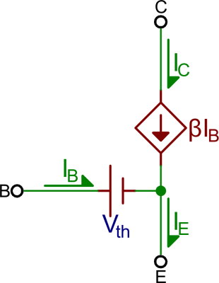
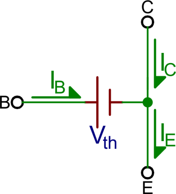

# Transistor (NPN)

Un transistor est un composant qui permet de contrôler un courant plus grand avec un petit courant.

Dans ce cours, nous allons principalement utiliser le transistor NPN. Dans votre trousse, c'est le S8050. À ne pas confondre avec un transistor S8550 qui est un transistor PNP. Leur fonctionnement diffère de manière non-intuitive. 

On utilise souvent le transistor NPN comme un interrupteur, mais il peut aussi servir d'amplificateur.


- **B** = Base (Contrôle)
- **C** = Collecteur (connecté au +)
- **E** = Emetteur  (connecté au -)

## Mode Actif

Le transistor entre en mode actif lorsque `V_c > V_b > V_e`

Le courant qui circule dans le transistor provient de la base et de l'émetteur. On peut estimer le courant en C à l'aide de la formule suivante : `I_C ≈ β x I_B` où β est un facteur d'amplification variable propre au transistor. Le courant en E deviendrait donc `I_C + I_B` ou `β + 1 x I_B`.



**Important :** Les transistors se comportent comme des diodes, donc il y a une tension  directe d'approximativement 0.7V entre B et E. Ce seuil doit être franchi par la tension en B pour entrer en mode actif.

La tension en E va être approximativement égale à `V_B - 0,7V`. 

Bien entendu, l'ensemble de l'oeuvre va se balancer sur l'ensemble des composants dans le circuit. Donc si une résistance suffisamment élevée suit l'émetteur, l'ensemble des paramètres vont s'ajuster de façon à s'équilibrer dans le respect des règles précédentes. 

### Exemple 1


On peut estimer certains paramètres du circuit ainsi : 

```
V_e = 0
V_b = 0.7
V_R2 = 2.3

I_R2 = 0.115mA
I_e = 101 * 0.115 = 11.615mA
I_c = 100 * 0.115 = 11.5mA
```

### Exemple 2


```
V_e = V_b - 0.7
I_e = V_e/1000 = (V_b - 0,7)/1000
I_b = I_e / 101 = (V_b - 0,7)/1000/101 = (V_b - 0,7)/101000
V_rb = I_b * 10000 = (V_b - 0,7)/101000 * 10000 = 10000(V_b - 0,7)/101000
V_rb = (10000V_b - 7000)/101000
V_rb = 3-V_b = (10000V_b - 7000)/101000
303000 - 101000V_b = 10000V_b - 7000
310000 = 111000V_b
2.79 = V_b # On a la tension en B, on peut calculer le reste
V_e = V_b - 0.7 = 2.09
I_e = 2.09 / 1000 = 2.09mA 

# On commence ici a se valider. Normalement on devrait pouvoir obtenir que I_rb = 101I_e
I_rb = (3-2.79)/10000 = 0.021mA
I_e  = 101I_rb = 0.021 * 101 = 2.12mA
2.12mA ≈ 2.09mA => La différence provient de mes arrondissements
```

### Exemple 3


**On le fait ensemble!**

## Mode Saturation

En mode **Saturation**, le transistor va, à toute fin pratique, court circuité entre C et E. Il va - néanmoins - avoir une perte de tension d'environ 0.2-0.3V entre C et E.

Dans ce mode, le courant en C n'est pas pratiquement plus contrôlé par le courant en B. 

Le mode saturation est atteint lorsque `V_B > V_C && V_B > V_E && V_BE > V_th` où V_th est un seuil propre au transistor (généralement notre 0.7V). 



**Exemple :**


```

# On commence en testant en prenant pour acquis que le transistor se comporte en
# mode actif. Si les maths ne mathent pas, on test avec le mode saturation

V_e = V_b - 0.7 = 0 # Connecté directement au ground
V_b = V_e + 0.7 = 0.7
V_R2 = 3 - V_b = 2.3
I_b = 2.3/10000  = 0.23mA
I_e = 101 * 0.23mA = 23.23mA
I_c = 23mA

V_R1 = 23mA * 500mA = 11.5V !!! -> Dépasse le 5V en C

# Les maths ne mathent pas - on regarde si le modèle de saturation est réaliste

V_ce = V_e + 0.2 = 0.2V
I_R1 = 4.8 / 500 = 9.6mA

V_be = 0.7
I_R2 = 0.23mA

I_E = 9.83mA

```